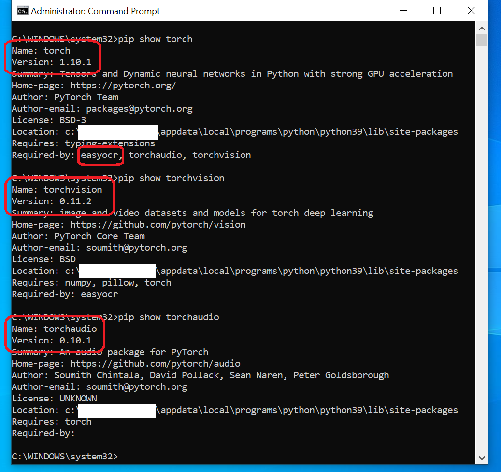

# Python Tutorial - Convert Pdf File to Excel File with EasyOCR and XlsxWriter

In this simple tutorial we will learn how to convert pdf file to excel file using EasyOCR and XlsxWriter, and related libraries/programs.

## Pre-requisites

For this tutorial run smoothly, we need to install several python package libraries.

notes : install python package libraries with the exact version, installed with different versions can make 	the program not running or error.

1. Install [Pillow](https://pypi.org/project/Pillow/)
   
2. Install [pdf2image](https://pypi.org/project/pdf2image/)

   
3. Install [Poppler](https://poppler.freedesktop.org/)

   
4. Install [PyTorch](https://pytorch.org/)

   
5. Install [EasyOCR](https://pypi.org/project/easyocr/)

   
6. Install [XlsxWriter](https://pypi.org/project/XlsxWriter/)

   

## How it Works

1. First we have to provide the pdf file that we want to convert, sample pdf files are in the pdf folder.

   
   The sample pdf file is a Purchase Order form.

   
2. Run program.py file in the root folder.

   `python program.py`

### **Steps in program.py**

1. Get list of pdf files in pdf folder.
2. Convert all pdf files to image file.

   

   library to convert pdf file to image file is **pdf2image** and **Poppler**.

   > from pdf2image import convert_from_path
   > popplerPath =r'C:\Program Files\poppler-0.68.0_x86\poppler-0.68.0\bin'
   > convertPdf2Image =convert_from_path(pdfFilePath, 500, poppler_path=popplerPath)
   >
3. Defined what text what we want to get from image file. ***( in blue box )***

   
4. Cropp converted pdf file to image file into several cropp images.

   
5. Get text value from cropped images.

   
6. Generate Excel file and insert data in table format.

   

   
